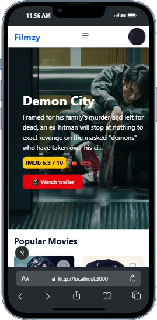

<a></a>
 <h1 align="center"> Flimzy  </h1>
<a></a>
<!-- Header with project name and brief description -->
 <!-- Image placeholder -->
[](https://git.io/typing-svg)
## Overview

## Overview
/*
 * Web application for movie enthusiasts
 * Features: Browse, bookmark, favorite movies
 * Tech: Next.js, TypeScript, TMDB API, Firestore
 */

## Features

### Movie Browsing (Public)
// Available to all users
- Browse trending/popular movies (no auth)
- Search functionality
- Detailed view requires authentication

### User Authentication
// Auth flow implementation
- Secure signup/login (Firestore)
- Protected routes
- Session management

### User Dashboard
/*
 * Authenticated users can:
 * - View bookmarks/favorites
 * - Manage their collection
 * - Dynamic updates
 */

### Movie Management
// Core functionality
- Bookmark movies (watch later)
- Favorite movies
- Watch trailers

## Tech Stack
// Dependencies and services
- Frontend: Next.js (React framework)
- Language: TypeScript
- Styling: Tailwind CSS
- API: TMDB
- Auth: Firebase
- DB: Firestore 

## Installation
/*
 * Setup instructions
 * Requires Node.js, TMDB API key, Firestore
 */

1. Clone repo:
```bash
git clone https://github.com/your-username/movieflicks.git
cd movieflicks